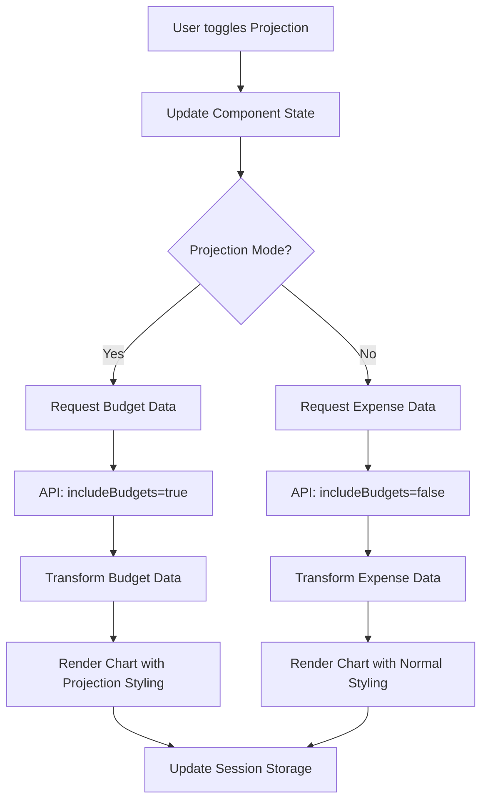

# Design Document

## Overview

The Dashboard Agrupadores Projection Mode feature adds a "Projection" checkbox to the existing dashboard that allows users to visualize their budget planning instead of actual expenses. This feature leverages the existing budget data infrastructure and chart components while providing a clear visual distinction between actual and projectiond data.

The implementation focuses on minimal code changes by reusing existing API endpoints with budget data inclusion, modifying the UI components to support projection mode, and ensuring proper state management across the dashboard tabs.

## Architecture

### Component Architecture

The projection mode feature integrates into the existing dashboard architecture:

```
Dashboard Groupers Page
├── Filter Controls (Enhanced)
│   ├── Estudio Filter
│   ├── Agrupador Filter
│   ├── Payment Method Filter
│   ├── Budget Toggle
│   └── Projection Checkbox (NEW)
├── Tab Navigation
│   ├── Vista Actual (Projection-enabled)
│   ├── Comparación por Períodos (Projection-disabled)
│   └── Acumulado Semanal (Projection-disabled)
└── Chart Components (Enhanced)
    ├── Grouper Chart (Modified for projection)
    ├── Category Chart (Modified for projection)
    └── Chart Tooltips (Enhanced for projection)
```

### Data Flow Architecture



## Components and Interfaces

### Enhanced Filter Controls

**Location**: `app/dashboard/groupers/page.tsx`

**New State Variables**:

```typescript
const [projectionMode, setProjectionMode] = useState<boolean>(false);
```

**New UI Component**:

```typescript
// Projection Mode Checkbox
<div className="flex items-center space-x-2">
  <Checkbox
    id="projection-mode"
    checked={projectionMode}
    onCheckedChange={setProjectionMode}
    disabled={activeTab !== "current"}
  />
  <Label htmlFor="projection-mode">Simular</Label>
</div>
```

### Modified Chart Components

**Grouper Chart Enhancements**:

- Add projection styling (different opacity/colors)
- Update chart title to include "(Simulación)" when in projection mode
- Modify tooltips to show "Presupuesto: $X" instead of expense amounts
- Update legend labels for projection context

**Category Chart Enhancements**:

- Apply same projection styling as grouper chart
- Ensure category drill-down maintains projection state
- Update category tooltips for budget context

### Data Transformation Layer

**Budget Data Processing**:

```typescript
const processProjectionData = (data: GrouperData[], isProjecting: boolean) => {
  return data.map((item) => ({
    ...item,
    // Use budget_amount as total_amount when projecting
    total_amount: isProjecting ? item.budget_amount || 0 : item.total_amount,
    // Add projection flag for styling
    isProjectiond: isProjecting,
  }));
};
```

## Data Models

### Enhanced GrouperData Interface

```typescript
type GrouperData = {
  grouper_id: number;
  grouper_name: string;
  total_amount: number;
  budget_amount?: number;
  isProjectiond?: boolean; // NEW: Flag for projection mode
};
```

### Enhanced CategoryData Interface

```typescript
type CategoryData = {
  category_id: string;
  category_name: string;
  total_amount: number;
  budget_amount?: number;
  isProjectiond?: boolean; // NEW: Flag for projection mode
};
```

### Session Storage Schema

```typescript
type ProjectionState = {
  projectionMode: boolean;
  lastUpdated: number;
};
```

## Error Handling

### Projection-Specific Error Cases

1. **No Budget Data Available**:
   - Display zero values with informative tooltips
   - Show message: "No hay datos de presupuesto disponibles"
   - Maintain chart structure with empty bars

2. **Partial Budget Data**:
   - Show available budget data
   - Display zero for missing budget entries
   - Tooltip indicates "Sin presupuesto asignado"

3. **Filter Conflicts**:
   - When payment method filters are applied in projection mode
   - Show budget data regardless of payment method (budgets are payment-method agnostic)
   - Display informative message about filter behavior in projection

### Error Recovery Strategies

```typescript
const handleProjectionError = (error: Error) => {
  // Log error for debugging
  console.error('Projection mode error:', error);

  // Fallback to actual data
  setProjectionMode(false);

  // Show user-friendly message
  toast({
    title: 'Error en modo proyección',
    description: 'Mostrando datos reales en su lugar',
    variant: 'destructive',
  });
};
```

## Testing Strategy

### Unit Tests

1. **Projection Mode State Management**:
   - Test checkbox toggle functionality
   - Verify state persistence in session storage
   - Test state restoration on page reload

2. **Data Transformation**:
   - Test budget data processing
   - Verify chart data transformation for projection
   - Test fallback behavior for missing budget data

3. **UI Component Behavior**:
   - Test checkbox disable/enable based on active tab
   - Verify visual styling changes in projection mode
   - Test tooltip content changes

### Integration Tests

1. **API Integration**:
   - Test API calls with `includeBudgets=true` parameter
   - Verify data fetching with different filter combinations
   - Test error handling for API failures

2. **Chart Rendering**:
   - Test chart updates when toggling projection mode
   - Verify category drill-down in projection mode
   - Test chart styling and legend updates

3. **Filter Interaction**:
   - Test projection mode with estudio filters
   - Test projection mode with agrupador filters
   - Test projection mode with payment method filters

### End-to-End Tests

1. **User Workflow Tests**:
   - Complete user journey from enabling projection mode to viewing charts
   - Test navigation between tabs with projection mode enabled
   - Test session persistence across page refreshes

2. **Cross-Browser Compatibility**:
   - Test projection mode functionality across different browsers
   - Verify session storage behavior
   - Test responsive design with projection controls

## Implementation Phases

### Phase 1: Core Functionality

- Add projection mode state management
- Implement checkbox UI component
- Add basic data transformation logic
- Enable projection mode for Vista Actual tab only

### Phase 2: Visual Enhancements

- Implement projection styling for charts
- Update tooltips and legends
- Add chart title modifications
- Implement visual indicators for projection mode

### Phase 3: Advanced Features

- Add session storage persistence
- Implement error handling and fallbacks
- Add category drill-down projection support
- Optimize performance for large datasets

### Phase 4: Polish and Testing

- Comprehensive testing suite
- Performance optimization
- Accessibility improvements
- Documentation updates

## Performance Considerations

### Data Fetching Optimization

- Reuse existing API endpoints with `includeBudgets=true`
- Implement client-side caching for budget data
- Minimize API calls when toggling between modes

### Chart Rendering Optimization

- Use React.memo for chart components to prevent unnecessary re-renders
- Implement efficient data transformation algorithms
- Optimize chart animations for mode switching

### Memory Management

- Clean up projection state on component unmount
- Implement proper session storage cleanup
- Monitor memory usage with large datasets

## Security Considerations

### Data Access Control

- Ensure projection mode respects existing user permissions
- Validate budget data access through existing authentication
- Maintain data isolation between different estudios

### Session Storage Security

- Store only non-sensitive projection preferences
- Implement proper session cleanup on logout
- Validate stored projection state on restoration

## Accessibility

### Keyboard Navigation

- Ensure projection checkbox is keyboard accessible
- Maintain proper tab order in filter controls
- Implement keyboard shortcuts for mode switching

### Screen Reader Support

- Add proper ARIA labels for projection checkbox
- Ensure chart accessibility in projection mode
- Provide clear announcements when mode changes

### Visual Accessibility

- Maintain sufficient color contrast in projection mode
- Provide alternative visual indicators beyond color
- Ensure projection mode works with high contrast themes
