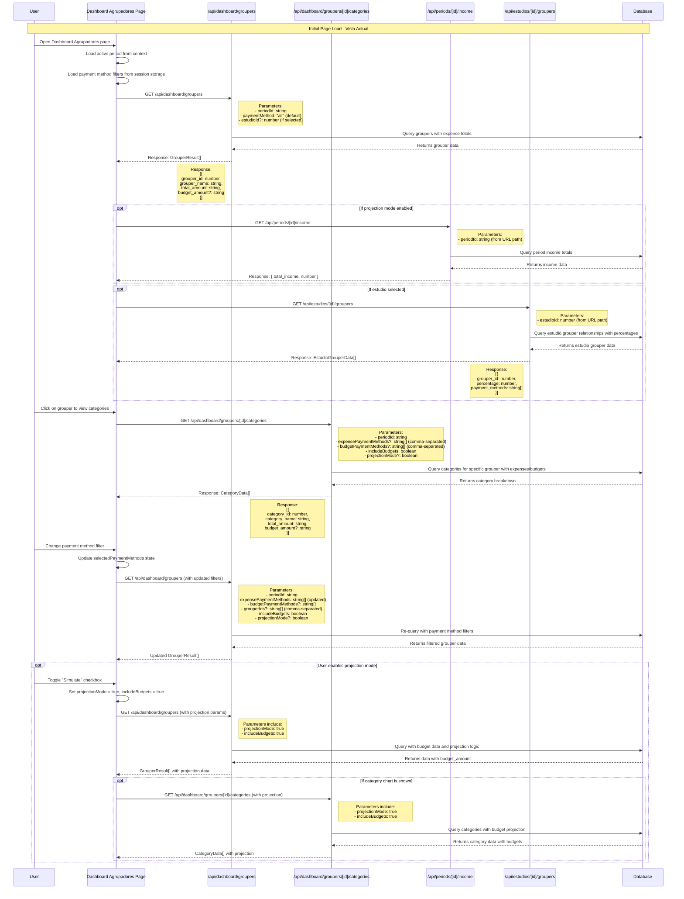
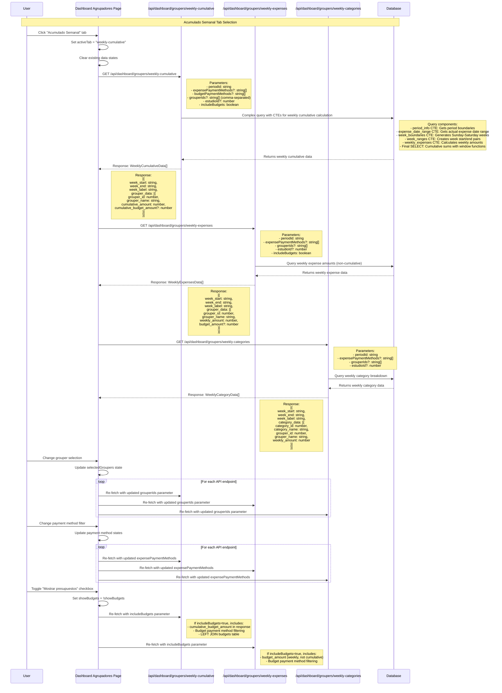

# Dashboard Agrupadores - Sequence Diagram

This document shows the complete data flow from frontend to backend for the Dashboard Agrupadores views: **Vista Actual** and **Acumulado Semanal**.

## Vista Actual (Current View) - Sequence Flow



## Acumulado Semanal (Weekly Cumulative) - Sequence Flow



## Key Data Structures

### GrouperResult (Vista Actual)
```typescript
interface GrouperResult {
  grouper_id: number;
  grouper_name: string;
  total_amount: string;    // Total expenses for the period
  budget_amount?: string;  // Total budgets (only if includeBudgets=true)
}
```

### CategoryData (Category Drill-down)
```typescript
interface CategoryData {
  category_id: number;
  category_name: string;
  total_amount: string;    // Total expenses for the category
  budget_amount?: string;  // Total budgets (only if includeBudgets=true)
}
```

### WeeklyCumulativeData (Acumulado Semanal)
```typescript
interface WeeklyCumulativeData {
  week_start: string;      // YYYY-MM-DD format
  week_end: string;        // YYYY-MM-DD format
  week_label: string;      // "Semana del DD/MM - DD/MM"
  grouper_data: {
    grouper_id: number;
    grouper_name: string;
    cumulative_amount: number;         // Running total up to this week
    cumulative_budget_amount?: number; // Running budget total (if includeBudgets=true)
  }[];
}
```

### WeeklyExpensesData (Weekly Bar Chart)
```typescript
interface WeeklyExpensesData {
  week_start: string;
  week_end: string;
  week_label: string;
  grouper_data: {
    grouper_id: number;
    grouper_name: string;
    weekly_amount: number;    // Expenses for this specific week only
    budget_amount?: number;   // Budget for this specific week only
  }[];
}
```

## API Parameter Summary

### Common Parameters
- `periodId`: Current active period ID (required)
- `expensePaymentMethods`: Comma-separated payment methods for expense filtering ("cash", "credit", "debit")
- `budgetPaymentMethods`: Comma-separated payment methods for budget filtering
- `grouperIds`: Comma-separated grouper IDs for filtering specific groupers
- `estudioId`: Study/Estudio ID for contextual filtering
- `includeBudgets`: Boolean flag to include budget data in response
- `projectionMode`: Boolean flag for projection/simulation mode (Vista Actual only)

### Database Query Patterns

#### Vista Actual Queries
- Main grouper query uses JOINs across: `groupers` → `grouper_categories` → `categories` → `expenses`
- Budget data added via LEFT JOIN to `budgets` table
- Payment method filtering applied to both expenses and budgets
- Estudio filtering uses INNER JOIN to `estudio_groupers` with payment method configuration

#### Acumulado Semanal Queries
- Uses Common Table Expressions (CTEs) for complex week boundary calculations
- Week boundaries calculated as Sunday-to-Saturday ranges
- Cumulative calculations use window functions with `ROWS UNBOUNDED PRECEDING`
- Three separate endpoints provide different data views of the same weekly structure

## Error Handling

### Projection Mode Errors
- Frontend includes error recovery mechanisms for budget data issues
- Backend returns structured error responses with `projectionError: true` flag
- Fallback suggestions provided when budget data is insufficient

### Payment Method Validation
- All payment method parameters validated against allowed values: ["cash", "credit", "debit"]
- Invalid payment methods return 400 status with descriptive error messages

### Database Connection Handling
- Timeout and connection errors specifically handled with user-friendly messages
- Syntax errors in dynamic queries caught and reported appropriately